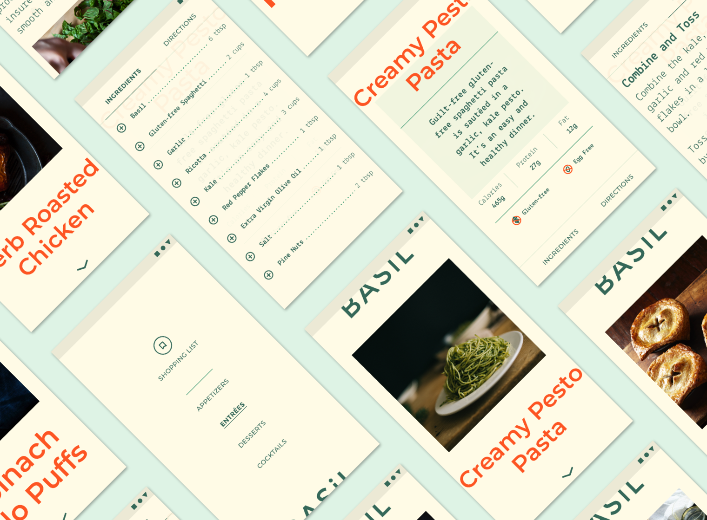

> 

# Sofrito
> An explorative implementation of the Material Design Study app [Basil](https://material.io/design/material-studies/basil.html#about-basil) utilizing Jetpack Compose. Additional features added to complete the app and make it a fully functional recipe app!

### Features

- Parse [recipe schema](https://schema.org/Recipe)
- Multiple simultaneous timers
- Nextcloud Cookbook integration
- Calendar with meal plan
- Merged ingredient shopping list creation
- Tablet-First UI

